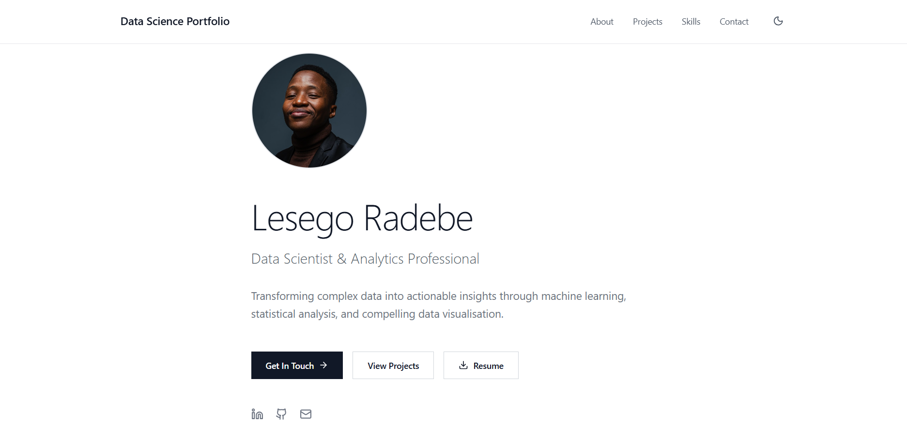
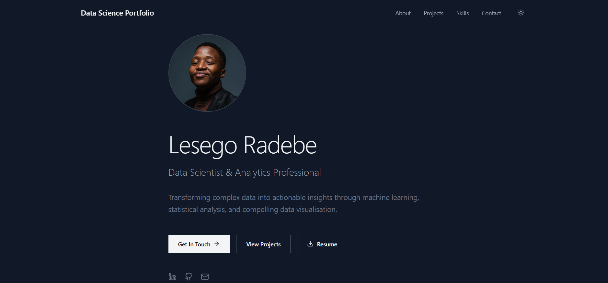

# Professional Personal Portfolio

A modern, responsive personal portfolio website showcasing my journey as a Data Scientist and Analytics Professional. Built with React and featuring a clean, minimalist design with dark mode support.





## Table of Contents

- [Overview](#overview)
- [Features](#features)
- [Technologies Used](#technologies-used)
- [Getting Started](#getting-started)
- [Customisation](#customisation)
- [Deployment](#deployment)

## Overview

This portfolio website serves as a comprehensive showcase of my technical skills, projects, and professional background in data science and analytics. It was developed as part of my Week 7 capstone project for the professional development bootcamp.

**Live Demo:** [https://personal-portfolio-website-seven-ecru.vercel.app/]

## Features

- **Responsive Design** - Fully optimised for desktop, tablet, and mobile devices
- **Dark/Light Mode** - Toggle between themes for comfortable viewing
- **Smooth Scroll Navigation** - Seamless transitions between sections
- **Interactive Project Gallery** - Hover effects reveal project details
- **Professional Sections:**
  - Hero/Landing page with profile
  - About Me with key metrics
  - Featured Projects with collage layout
  - Technical Skills breakdown
  - Contact information

## Technologies Used

### Frontend
- **React** - UI component library
- **JavaScript (ES6+)** - Core programming language
- **Tailwind CSS** - Utility-first CSS framework
- **Lucide React** - Icon library

### Tools & Libraries
- **useState Hook** - State management for dark mode and interactions
- **Smooth Scroll API** - Native smooth scrolling behavior

## Getting Started

### Prerequisites
- Node.js (v14 or higher)
- npm or yarn package manager

### Installation

1. Clone the repository
```bash
git clone https://github.com/lesego1005/professional-portfolio.git
cd professional-portfolio
```

2. Install dependencies
```bash
npm install
```

3. Start the development server
```bash
npm start
```

4. Open your browser and navigate to `http://localhost:3000`

## Customisation

### Adding Your Own Projects

Edit the `projects` array in `App.jsx`:

```javascript
{
  id: 5,
  title: "Your Project Name",
  description: "Brief description of what the project does",
  technologies: ["Tech1", "Tech2", "Tech3"],
  metrics: ["Metric 1", "Metric 2", "Metric 3"],
  image: "project5.jpg",
  link: "https://github.com/yourusername/project-repo"
}
```

### Updating Skills

Modify the `skills` object to reflect your technical expertise:

```javascript
const skills = {
  "Category Name": ["Skill 1", "Skill 2", "Skill 3"]
};
```

### Adding Local Images

1. Place your images in the `public` folder
2. Update the `image` property in your projects with the filename
3. Recommended image specs:
   - Format: JPG or PNG
   - Dimensions: 800px × 600px minimum
   - Aspect Ratio: 4:3
   - File size: Under 500KB

### Changing Theme Colors

The portfolio uses Tailwind CSS. Modify color classes in the component:
- Light mode: `bg-white`, `text-gray-900`
- Dark mode: `bg-gray-900`, `text-gray-100`

## Deployment

### Deploy to Vercel

1. Push your code to GitHub
2. Import project in Vercel dashboard
3. Vercel will auto-detect React and deploy

## Featured Projects

### 1. NYC Airbnb Data Analysis
- Analysed 49K listings across 5 NYC boroughs
- Technologies: Python, Scikit-learn, Pandas, NumPy, Matplotlib
- [View Project →](https://github.com/lesego1005/NYC-Airbnb-Analysis)

### 2. Music Store Analytics
- SQL-based analysis of digital music store data
- Technologies: SQL, SQLite, Jupyter Notebook
- [View Project →](https://github.com/lesego1005/Music-store-analytics-SQL-project)

### 3. Northwind Traders Analytics
- Comprehensive SQL analysis of trading company dataset
- Technologies: SQL, SQLite, Jupyter Notebook
- [View Project →](https://github.com/lesego1005/northwind_traders_analytics)

### 4. AI Coding Assistant
- Intelligent web application for code assistance
- Technologies: HTML, CSS, JavaScript, Node.js
- [View Project →](https://github.com/lesego1005/ChatBot_Project)

## Key Metrics

- **1+ Years** of experience in data science
- **15+ Projects** completed across various domains
- **10+ Technologies** mastered in analytics and ML

## License

This project is open source and available under the [MIT License](LICENSE).

## Acknowledgments

- Bootcamp instructors and mentors for guidance
- Cohort peers for feedback and collaboration
- Open source community for tools and resources

---

⭐ **If you found this portfolio helpful, please consider giving it a star!**

Built with ❤️ by Lesego Radebe | © 2025 All Rights Reserved
